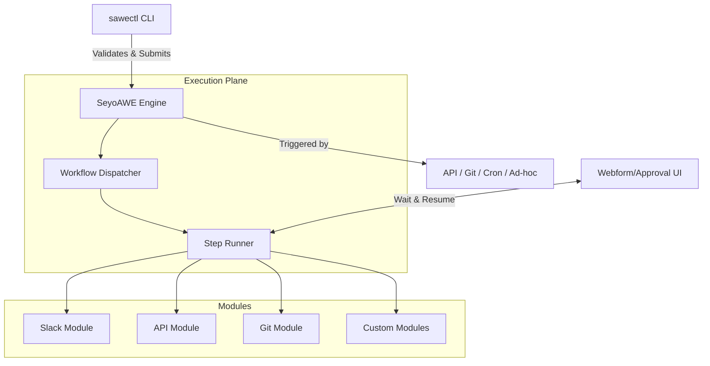

# SeyoAWE Documentation Index

## Overview

**SeyoAWE** is a modular, GitOps-native, human-in-the-loop automation platform. It allows users to define powerful, reliable workflows in YAML — with built-in support for approvals, forms, Git, APIs, Slack, and more. It is designed to be crash-resilient with persistent state, resumable runs, and detailed logs.

## Tech Stack

- **Python**: Core language for the engine, `sawectl` CLI, and modules.
- **Flask**: Web framework for the runtime engine (listening at `http://localhost:8080`).
- **PyYAML**: For YAML parsing of workflow and module definition files.
- **jsonschema**: For robust schema validation of workflows and module manifests.
- **Requests**: For HTTP communications within built-in modules like API and Slack.
- **React**: Used for webform UI (internal reference based on README).

## High-Level Architecture



## Documentation Index

| Supercomponent | Description | Documentation |
| --- | --- | --- |
| **`sawectl`** | The CLI tool to manage, validate, and run workflows. Includes DSL parsing. | [Docs](./sawectl/) |
| **`modules`** | Pluggable Python classes and definition manifests for integrations. | [Docs](./modules/) |

## How to Run the Project

### Prerequisites

- Python 3.10+
- The `sawectl` CLI requires installing dependencies:
  ```bash
  pip install -r sawectl/requirements.txt
  ```

### Starting the Local Engine

Launch the Flask-powered SeyoAWE runtime:

```bash
# For Linux
./run.sh linux

# For macOS (ARM)
./run.sh macos
```

The engine will start at `http://localhost:8080`. Ensure your configuration is correctly set to point to the `modules` and `workflows` directories.

### Running a Workflow Ad-hoc

Using `sawectl`, you can trigger a workflow:

```bash
python sawectl/sawectl.py run --workflow workflows/my-workflow.yaml --server localhost:8080
```

## Environment Variables / Configuration

Configuration is managed via `configuration/config.yaml`. Key sections include:

- `directories.workdir`: Working directory for execution.
- `directories.modules`: Path to installed modules.
- `directories.workflows`: Path to workflow DSL files.
- `app.port`: Port for the SeyoAWE engine (default: 8080).

**Module specific configuration defaults:**

| Module | Expected config/env keys | Description |
| --- | --- | --- |
| `chatbot` | `api_key` | OpenAI / Mistral API key |
| `api` | `default_api_token` | Default token injected in Context |
| `email_module` | `smtp_pass`, `smtp_user`, `smtp_host` | SMTP credentials |
| `slack_module` | `webhook_url` | Default webhook for slack notifications |
| `git_module` | `github_token` | GitHub access token |

For full details, review `configuration/config.yaml`.
