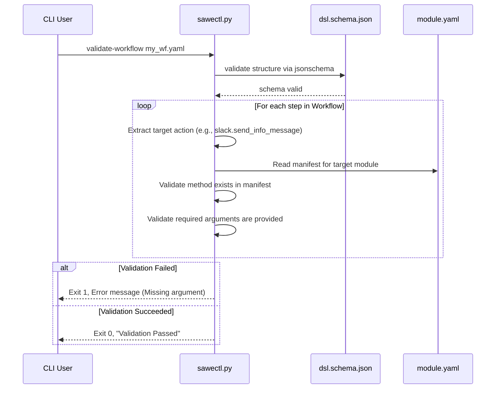
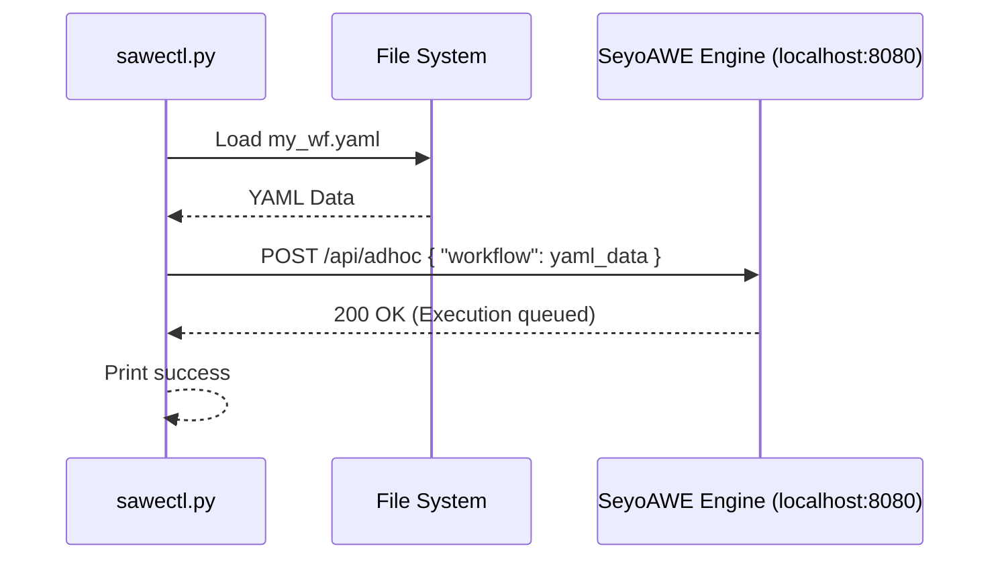

# sawectl Data Flow

This document outlines how `sawectl` processes, validates, and acts upon workflow definitions.

## Workflow Deep Validation Flow

## Workflow Execution (Ad-hoc run)

When triggering an ad-hoc run, the data flow simply consists of loading the YAML and posting it to the engine. The Engine is responsible for runtime execution.

## Scaffolding (`init workflow --full`)

The full scaffolding process reads from both schemas and module directories to stitch together a comprehensive starting template.

1. **Load Schema**: Reads `dsl.schema.json` and recursively builds an empty dict structure using `$defs` definitions.
2. **Resolve Trigger**: Validates and assigns the `--trigger` flag directly into the template.
3. **Collect Steps**: Scans the `modules/` directory for `usage_reference.yaml` files.
4. **Assemble Workflow**: Populates the template `steps` list with real-world examples taken from the modules.
5. **Format YAML**: Writes back out to `workflows/<name>.yaml`, injecting custom spacing for readability.
